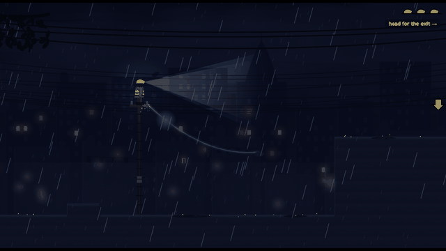
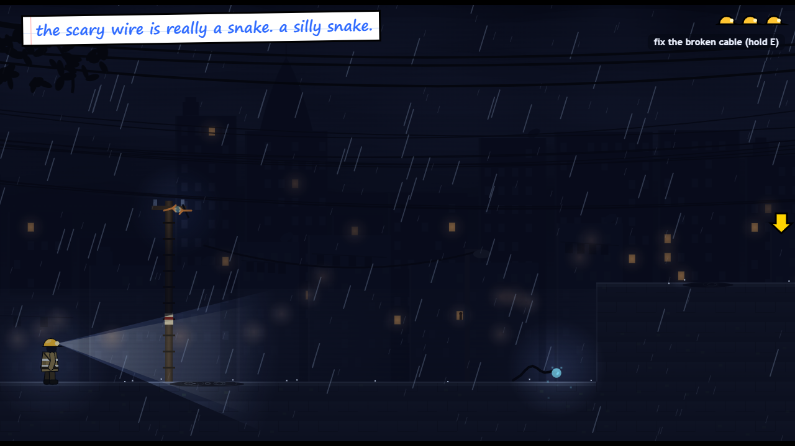
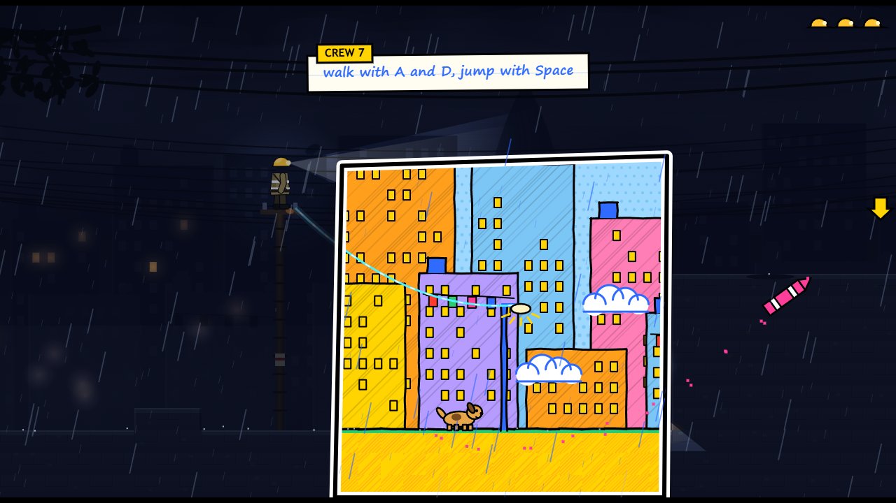
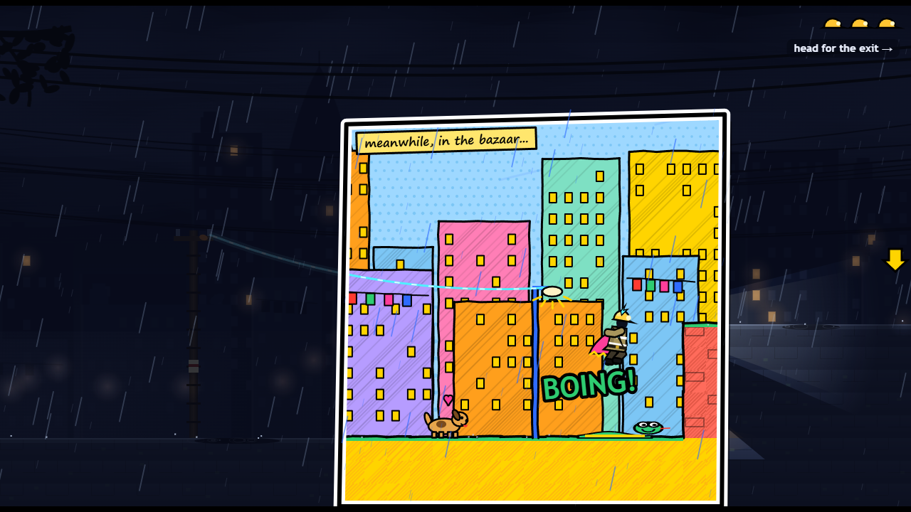
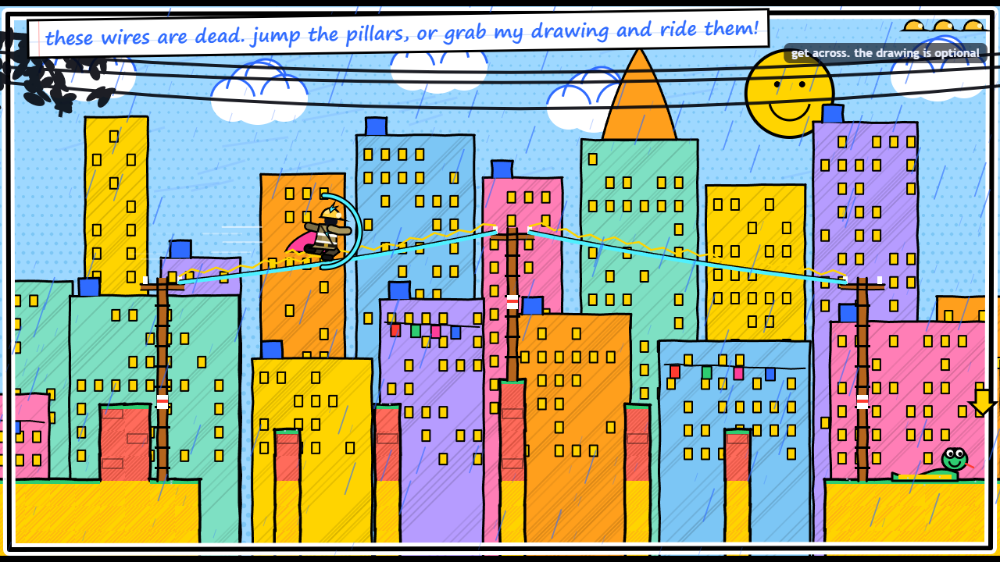
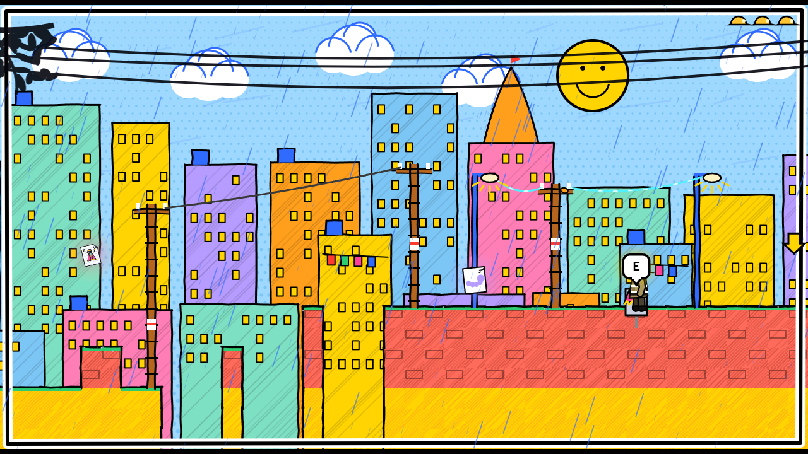

# BIJLI

> _A monsoon night. The city's power is out. Someone has to climb the poles in the storm._

**BIJLI** is a short browser platformer about the people who bring the light back. You play **Crew 7**, a lineworker
climbing poles in a city-wide blackout to splice snapped cables, one street at a time. At home, a child named
**Chinni** is drawing a comic about Crew 7 by candlelight, and wherever you restore the light, the rainy night turns
into her crayon comic: clouds to stand on, live wires to ride, dangers turned into friendly cartoons.

_Bijli_ means both **electricity** and **lightning** in Hindi.

Made by **Team Buggernaut** (Hansika Grover, Navya Upadhyay, Shaurya Chandel) for the
**TGC Game Jam @ Infinium '26** (IIIT Hyderabad · GDAI × Games for Change India). Themes: **Comic · Twist · Light**.



|                                                                             |                                                                    |
| --------------------------------------------------------------------------- | ------------------------------------------------------------------ |
|                               |  |
|  |        |



Gameplay video: [submission/bijli-gameplay.webm](submission/bijli-gameplay.webm) · Pitch: [submission/PITCH.md](submission/PITCH.md)

---

## Why we made this game

Every monsoon, storms knock out power across Indian cities, and the light comes back because lineworkers climb wet
poles in the dark and repair the lines by hand. It is skilled, physical, dangerous work, and almost nobody sees it: we
notice the fan starting again, not the person on the pole.

It is also work that people still call "not a job for women". BIJLI is inspired by the **linewomen of Telangana**. In
2022, **Babburi Sirisha** from Siddipet became the first woman appointed junior lineman at the state's southern power
distribution company after clearing the pole-climbing test, and Telangana's power sector had earlier recruited around
200 linewomen. Our hero is fictional, but the job and the people who do it are real.

We wanted players to _feel_ that, not read a lecture about it. So the message is built into how the game plays:

- **The work is the gameplay.** You never fight anyone. You climb, find the break, isolate the line and twist the
  cable back together. The core verb of the game is a repair.
- **Safety comes first, every time.** A sparking cable is live. The game teaches the real rule from the opening comic
  onwards: _find the breaker, switch it off, then repair, then switch it back on_. Try to splice a live line and you are
  shocked back; flooded streets are deadly while their line is on. The end card says it plainly: **never touch a fallen
  wire; call your local electricity helpline.** (The comic power-ups are a child's imagination, clearly marked as such.)
- **The stakes are people.** Each light you restore brings a reaction from the street it belongs to: the chai stall
  opens, the medicine-shop fridge gets cold again, a hospital ward is warm enough for the babies to sleep. The radio
  keeps you on the job; the hospital's backup is running low.
- **The light is what changes the world.** Bringing power back is literally what opens the path forward: lit areas turn
  into Chinni's comic, which is how a child sees the person keeping her city running.
- **The twist asks you to check your assumptions** _(spoiler for the ending, skip this point if you have not played)_. The lineworker wears a helmet, a raincoat and a face in shadow, and
  is never given a pronoun: just "Crew 7". At the end, the house lights up, the helmet comes off, and Chinni draws the
  last page: _"my amma is bijli."_ If you pictured a man under that helmet, the game never said so.

## The story in one night

1. **Opening comic.** The storm snaps the city's lines, the hospital is on backup, families wait by candlelight. Crew 7
   is sent out with one rule: a line is only touched when it is switched off. At home, Chinni starts drawing.
2. **Chapter 1 · Gali No. 4.** A quiet lane. The first lamp comes back on, and you discover that light turns the street
   into Chinni's comic.
3. **Chapter 2 · The Bazaar.** Snapped wires over the shops. A fallen live wire in the dark becomes Taar-Naag, a silly
   snake, once it is lit. Chinni draws you a cape.
4. **Chapter 3 · The Storm.** A flooded underpass, lightning strikes, the city hospital and the substation that brings
   the whole skyline back.
5. **Chapter 4 · Ghar.** The rain thins. One last line, to a small house with a candle in the window.

Between chapters, Chinni's phone messages keep you company: _"are you scared of thunder? i am only a little."_

## How it plays

**The rule: fix the light, and the comic opens a path.**

- **In the dark** you are a lineworker in a real, rain-soaked city with only a headlamp. Climb poles, find snapped
  cables and hold **E** to twist them back together. Live lines must be switched off at their **breaker** first.
- **In the light**, every powered lamp drops a comic panel into the night. Inside it, crayon clouds become platforms,
  powered wires become rails you can grind, and deadly hazards become friendly cartoon versions of themselves.
- **Lightning** flashes briefly show you the whole comic page, a peek at where the paths will be.
- **Optional power-ups**, for players who want the shortcut:
  - **Chinni's drawing → BIJLI mode (8 s)**: double jump, glide with the cape (hold Space while falling), ride _any_
    wire, and nothing can hurt you. Every room can be finished without it; it turns a hard route into a fast one.
  - **The storm dragon drawing (8 s)**: Chinni draws the storm asleep. No strikes and no lightning while it sleeps.
- **Every fall costs something.** A death costs a helmet and the street goes dark again: its splices and breakers
  reset, so you redo the room. You get 3 helmets per chapter; lose all 3 and the chapter starts over.
- **The hospital backup is running out.** In the hospital you race the generator: restore both lines before the
  backup timer empties.
- **Later streets combine everything.** The Night Market makes you work a live breaker past a fallen wire you can
  only jump in the dark; the Flooded Crossing puts a splice inside a lightning column, in water that is only safe
  while its breaker is off.
- First-time hint cards, a live objective line and an arrow over the exit mean you always know what to do next.

A first playthrough takes about **12–15 minutes**. Skip room, restart room, mute and **reduce flashing** are in the
pause menu (Esc or P), and the title screen has a flashing notice with a toggle (F).

## Controls

| Action       | Keys                                                  |
| ------------ | ----------------------------------------------------- |
| Move         | A / D or ← / →                                        |
| Jump         | Space (or W / ↑ when not on a pole)                   |
| Glide        | hold Space while falling (BIJLI mode)                 |
| Climb        | W / S on poles and ladders                            |
| Interact     | E: tap for breakers · **hold** to splice a cable      |
| Pause        | Esc or P (resume, restart, skip room, mute, flashing) |
| Restart room | R                                                     |

No mouse needed.

## Play it

**In the browser:** see our Indieconnect submission page.

**Locally:**

```bash
npm install
npm run dev        # then open http://localhost:5173
```

**From the zip:** `npm run build` produces `dist/`, which runs from any static web server (the build uses relative
paths). Browsers block module scripts from `file://`, so serve the folder rather than double-clicking `index.html`, for
example `npx vite preview` or upload it as an HTML5 game.

## How the themes are used

| Theme     | In the gameplay                                                          | In the world                                 | In the story                                             |
| --------- | ------------------------------------------------------------------------ | -------------------------------------------- | -------------------------------------------------------- |
| **Light** | Restoring power is the goal, and light is what changes the level         | A blacked-out city lighting up, lamp by lamp | The neighbours cheer; the last light is home             |
| **Twist** | Every repair is a twist of the cable; light twists dangers into cartoons | Every real hazard has a comic double         | The hero is Amma                                         |
| **Comic** | Lit areas become Chinni's comic, and her drawings are the power-ups      | Ink outlines, halftone dots, crayon colours  | The story is Chinni's comic; the finale is its last page |

## Rooms and the proposal

The proposal promised one stormy night in seven places. The game has an opening comic, four chapters and 13
single-screen rooms:

| Proposal level    | In the game                                                                                      |
| ----------------- | ------------------------------------------------------------------------------------------------ |
| 1. The lane       | Chapter 1: 1-1 First Light, 1-2 The Flash, 1-3 The Live Line                                     |
| 2. The bazaar     | Chapter 2: 2-1 Taar-Naag (the snake), 2-2 Rooftop Rails, 2-2b Night Market, 2-3 Chinni's Drawing |
| 3. The underpass  | 3-1 Underpass (flooded road, breaker and live water), 3-1b Flooded Crossing (water + lightning)  |
| 4. The rooftops   | 3-2 Strikes (lightning columns); 2-2 Rooftop Rails also plays on the roofs                       |
| 5. The hospital   | 3-2b City Hospital (flooded basement, two circuits, a race against the backup generator)         |
| 6. The substation | 3-3 Substation (master breaker and the skyline bloom)                                            |
| 7. Home           | 4-1 Ghar, then the finale                                                                        |

Differences from the proposal, stated plainly:

- **The substation is a puzzle room, not a boss fight.** The proposal's "storm's fire dragon" became the **storm
  dragon drawing**, an optional power-up that puts the storm to sleep, rather than an enemy. It fits a game where you
  never fight anyone.

## How we built it

- **Phaser 3 + TypeScript + Vite.** All art is drawn in code (Canvas 2D compositing of a "real" and a "comic" layer,
  masked by each lamp's comic panel) and all sound is synthesised with WebAudio at runtime, so the build has no asset
  files. Chinni's crayon pages (the logo, chapter cards, the opening comic and the finale) are drawn in code too, in a child's crayon style.
- **Design first:** the game was planned in a design document ([CLAUDE.md](CLAUDE.md)) and the team's proposal
  ([proposal.pdf](proposal.pdf)), then built with Claude Code as our coding assistant (see [AI_DISCLOSURE.md](AI_DISCLOSURE.md)).
- **Checked by machines, tuned by people:** `npm run validate-levels` proves every room is solvable without power-ups,
  and headless bot playthroughs in `tests/` finish every room. A playtest round then reshaped the difficulty curve, the
  optional power-ups, the story beats and the onboarding.

| Script                    | What it does                                                            |
| ------------------------- | ----------------------------------------------------------------------- |
| `npm run dev`             | Vite dev server                                                         |
| `npm run build`           | Typecheck + production build to `dist/`                                 |
| `npm test`                | Vitest: rules, timers, validator and headless playthroughs of each room |
| `npm run typecheck`       | `tsc --noEmit`                                                          |
| `npm run validate-levels` | Checks every room is well-formed and solvable                           |
| `npm run e2e`             | Playwright: title → credits flow + screenshots of every room            |

## AI usage

Claude Code (Anthropic) wrote most of the code and drafted the room maps and in-game text from the team's design; the
team designed the game, story and characters, directed every change and playtested it. No image, music or sound
generators were used, and no third-party assets are included. Full details in [AI_DISCLOSURE.md](AI_DISCLOSURE.md) and
[CREDITS.md](CREDITS.md).

## Credits and thanks

Team Buggernaut: **Hansika Grover** (systems and gameplay), **Navya Upadhyay** (art, shaders and sound),
**Shaurya Chandel** (levels and story). Made in 4 days at TGC Game Jam, Infinium '26. Made with Phaser 3.

Inspired by the linewomen of Telangana, who climb poles in the storm so the rest of us have light.

**Never touch a fallen wire. Call your local electricity helpline.**

## License

MIT, see [LICENSE](LICENSE).
